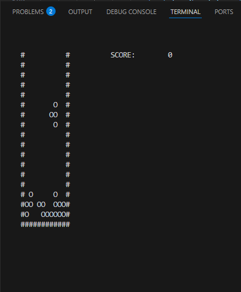

📘 README.md
markdown
Copy
Edit
# 🧱 TETRIS in C++ - Console Edition

> 🎮 A nostalgic console-based implementation of the classic **TETRIS** game written in **pure C++**, without any game engine or external library – just **you, the code, and the console**.


---

## 📺 Preview




## 🚀 Features

- 🔷 **Classic 7 Tetrominoes** (I, O, T, J, L, S, Z)
- ⌨️ Keyboard controls for movement and rotation
- 📦 2D playfield with borders and collision detection
- 💡 Custom rotation logic
- 💥 Line clearing & score tracking
- 🧠 Real-time rendering using `WriteConsoleOutputCharacterW`
- 💯 No external graphics libraries or game engines

---

## 🎮 Controls

| Key       | Action         |
|-----------|----------------|
| `←`       | Move Left      |
| `→`       | Move Right     |
| `↓`       | Soft Drop      |
| `Z`       | Rotate Piece   |

---


## 🛠️ How It Works

### 🧱 Tetromino Design
Each Tetris piece is stored as a `4x4` grid using Unicode characters (`X`, `.`):

```cpp
tetrominoes[0].append(L"..X.");
tetrominoes[0].append(L"..X.");
tetrominoes[0].append(L"..X.");
tetrominoes[0].append(L"..X.");
```

### 🔄 Rotation Logic
Rotation is handled using custom math within a flattened 4x4 matrix:

```cpp
int Rotate(int px, int py, int rotation) {
    switch (rotation % 4) {
        case 0: return py * 4 + px;
        case 1: return 12 + py - (px * 4);
        case 2: return 15 - (py * 4) - px;
        case 3: return 3 - py + (px * 4);
    }
    return 0;
}
```

### 🧠 Collision & Fit Check
Before placing a block, the game checks if it fits:

```cpp
bool DoesPieceFit(int tetromino, int rotation, int posX, int posY);
```

### 🎮 Game Loop
The main loop handles:
- Input (arrow keys and rotate)
- Piece movement
- Collision detection
- Locking blocks
- Line clearing
- Score tracking
- Drawing each frame to the console buffer

---


## 📈 Scoring System

🧱 Each line cleared: +25 points

📊 Score updates in real-time in the console

---


## 💡 Potential Improvements
🧪 Add piece preview and hold functionality

🌀 Add hard drop and ghost piece

🎨 Use color codes with SetConsoleTextAttribute

🎵 Add retro sound effects (maybe Beep API?)

🕹️ Port to Linux using ncurses or graphical libraries like SFML

---


## 📦 Requirements

- 🪟 Windows OS (uses `Windows.h` and `CreateConsoleScreenBuffer`)
- 🧠 Basic C++ knowledge
- 🛠️ C++17 or later compiler (e.g., MSVC, g++)

---

## ▶️ How to Run

**Clone the repository:**
```bash
git clone https://github.com/yourusername/cpp-console-tetris.git
cd cpp-console-tetris
```

Compile the code:
```bash
g++ -std=c++17 -o tetris tetris.cpp
```

Run the code:
```bash
./tetris
```
